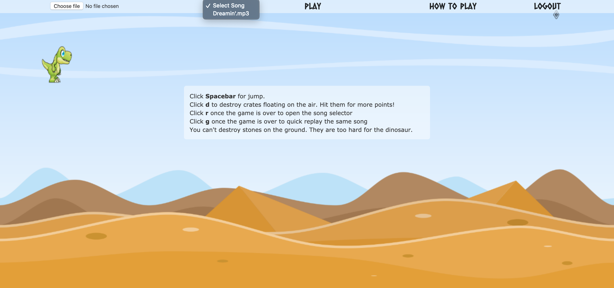
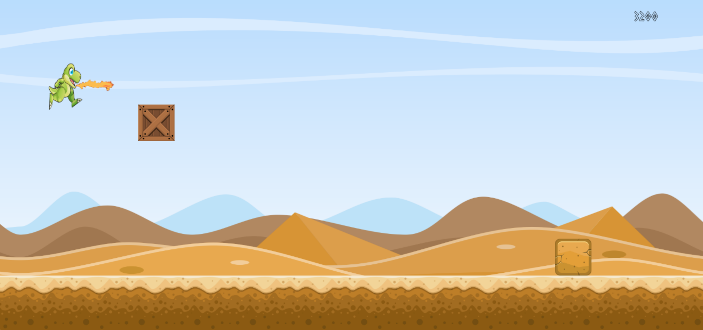

# Dinorun

### Technodactyl Studios resents their debut game - DINORUN
```
                  ,
               ,  ;:._.-`''.
             ;.;'.;`      _ `.
              ',;`       ( \ ,`-.  
           `:.`,         (_/ ;\  `-.
            ';:              / `.   `-._
          `;.;'              `-,/ .     `-.
          ';;'              _    `^`       `.
         ';;            ,'-' `--._          ;
':      `;;        ,;     `.    ':`,,.__,,_ /
 `;`:;`;:`       ,;  '.    ;,      ';';':';;`
              .,; '    '-._ `':.;    
            .:; `          '._ `';;,                      __
          ;:` `    :'`'       ',__.)                     / _)
        `;:;:.,...;'`'                          _.----._/ /
      ';. '`'::'`''  .'`'                      /         / 
    ,'   `';;:,..::;`'`'                    __/ (  | (  |           
, .;`      `'::''`                         /__.-'|_|--|_|          
,`;`.                                             
```

## Overview

Dinorun is a side scrolling platform game where the levels are procedurally generated based on audio files uplaoded by the user. 

It's built as a Single Page App, with a responsive design. It is played using the keyboard and also has touch screen controls so can be played on phone or tablet devices.

The level scores are stored in a database. The top three scores for the current level are displayed on the end screen.

## How to Install

The application has been developed using Ruby v2.6.5, Ruby on Rails v6.0.2.2 and PostgreSQL. Therefore to install the application please ensure you have the following installed:
- ruby 2.6.5 (can be installed from the terminal using homebrew ```brew install ruby``` and version checked using rvm ```rvm use 2.6.5```)
- bundler (can be installed from the terminal through ruby gems ```gem install bundler```)
- PostgreSQL (can be installed from the terminal using homebrew ```brew install postgres```)

Once the above has been installed, clone or download the git repository, move to the program root directory, then run the following in the command line to install the program:
- ```bundle```
- ```yarn```

Since the application requires persistent data, such as users and mp3 files, a PSQL database is used in conjunction with ApplicationRecord. To set the database up, first ensure you have PSQL installed and running as a service, then create a copy of ```config/example.application.yml``` named as ```application.yml```. Inside this new file, insert your database credentials.

To use AWS S3 in production open rails credentials using ```EDITOR=vim rails credentials:edit``` in the command line and add your IAM credentials in the AWS section.

To setup the database tables with the correct schema run the following in the command line:

```
rails db:create
rails db:migrate
```

## How to Run

To run the application in development, run `rails s` in the command line, then navigate to `http://localhost:3000/`.

To run the application in production, ensure the environment variable ```ENVIRONMENT=production``` is set before running `rails s`.


### Running Tests

Testing Suites: 
- Backend - Rspec, Capybara 
- Frontend - Jasmine

To run the backend tests run `rspec` in the command line
To run the frontend tests run `rails s` in the command line, then navigate to `http://localhost:3000/jasmine`

## Gameplay

#### Song Selection


#### Gameplay


#### Win Screen


### Game Engine Flow

Game developed in pure Javascript without frameworks. 


## Credits

[Chris Wood](https://github.com/cpcwood)

[Ben Gittins](https://github.com/squareben1)

[Umberto Valente](https://github.com/Uvalente)

[Shuenn Yuh Low](https://github.com/shaunlsy)

[Imraan Ali](https://github.com/Immers23)
